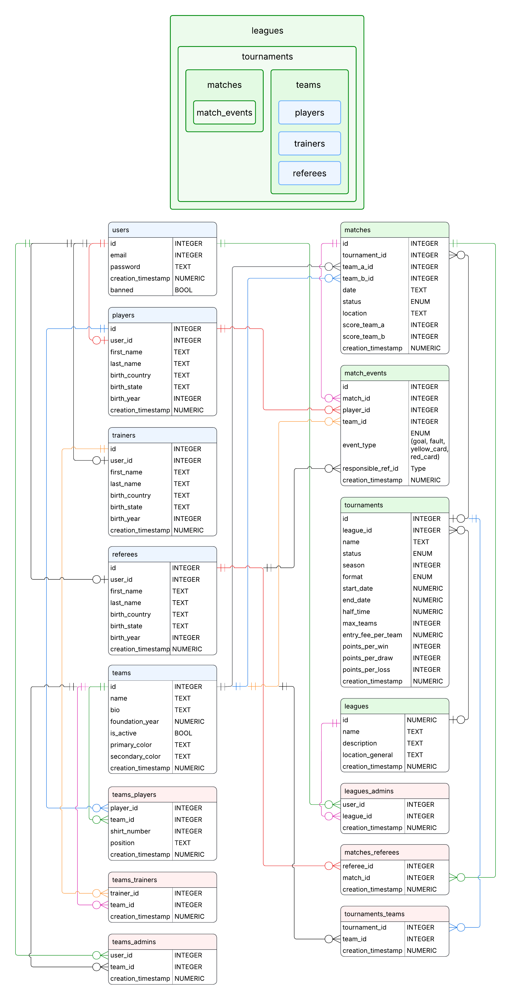

# Design Document

By Diego Couto

Video overview: <URL HERE> !@#$%!$#%wjfq;wo\

Github repo: https://github.com/nullspace000/cs50_sql_final_project  

## Scope

* What is the purpose of your database?  
  I'm not a soccer fan myself, but I have this Idea for an app: To represent football leagues. It would allow users to keep track of tournaments, create their own team, publish match location and so on.

* Which people, places, things, etc. are you including in the scope of your database?
  - Leagues
  - Tournaments
  - Matches
  - Match events
  - Teams
  - Players
  - Trainers
  - Referees
  - Users

* Which people, places, things, etc. are *outside* the scope of your database?
  - Venues 
  - Player specific performance metrics
  - Extra time and tiebreaker results.
  - Substitutions and injuries
  These are described better in the ## Limitations section.

## Functional Requirements

* What should a user be able to do with your database?
  - Create their user account.
  - Register themselves as a player.
  - Create a team (automatically adds themselves to the team_admins table).
  - Add other players to their team.
  - Remove players from their team.
  - Add trainers to their team.
  - Add other administrators to their team.
  - Create a league (automatically adds themselves to the leagues_admins table).
  - Create a tournament.
  - Add teams to the tournament.
  - Create a match.
  - Add referees to the match through the matches_referees table.
  - Start the match
  - Register a goal in the match_events table (updates the score on the matches table).
  - End the match

* What's beyond the scope of what a user should be able to do with your database?
  - Representing player specific performance metrics.
  - Registering some players to teams without them having to create a user account, to allow for flexibility when managin members and for non tech-savy people to take part without a device.
  - Keeping track of entry fee payments (this would be a good feature in the app).
  - Google maps links for the venues/soccer fields.
  - Profile photos for the players, trainers and referees.
  - Banners and logos for the teams page.

## Representation

Entities are captured in SQLite tables with the following schema...

### Entities

This database includes the following entities:

#### Users
 
The `users` table includes:
 
* `id`, which specifies the unique ID for the user as an `INTEGER`. This column thus has the `PRIMARY KEY` constraint applied.
* `email`, which specifies the user's email as `TEXT`. A `UNIQUE` constraint ensures no two users share the same email, and a `NOT NULL` constraint ensures it is always provided.
* `password`, which stores the user's password as `TEXT`. A `CHECK` constraint enforces a minimum length of 10 characters, and `NOT NULL` ensures it is always provided.
* `creation_timestamp`, which specifies when the user account was created, stored as `NUMERIC` per SQLite's timestamp conventions. It defaults to the current timestamp via `DEFAULT CURRENT_TIMESTAMP`.
* `banned`, which indicates whether the user has been banned, stored as `TEXT`. A `CHECK` constraint restricts its value to either `'true'` or `'false'`, and it defaults to `'false'`.

#### Players
 
The `players` table includes:
 
* `id`, which specifies the unique ID for the player as an `INTEGER`. This column thus has the `PRIMARY KEY` constraint applied.
* `user_id`, which is the ID of the associated user account as an `INTEGER`. This column has a `FOREIGN KEY` constraint referencing the `id` column in the `users` table, and a `UNIQUE` constraint ensures each user account is linked to at most one player profile.
* `first_name`, which specifies the player's first name as `TEXT NOT NULL`.
* `last_name`, which specifies the player's last name as `TEXT NOT NULL`.
* `birth_country`, which specifies the country where the player was born as `TEXT NOT NULL`.
* `birth_state`, which specifies the state where the player was born as `TEXT NOT NULL`.
* `birth_year`, which specifies the year the player was born as `INTEGER NOT NULL`.
* `last_game`, which stores the ID of the last game the player participated in as an `INTEGER`. This column is nullable, as a player may not have played any games yet.
* `creation_timestamp`, which specifies when the player profile was created, stored as `NUMERIC` and defaulting to the current timestamp.

#### Trainers
 
The `trainers` table includes:
 
* `id`, which specifies the unique ID for the trainer as an `INTEGER`. This column thus has the `PRIMARY KEY` constraint applied.
* `user_id`, which is the ID of the associated user account as an `INTEGER`. A `FOREIGN KEY` constraint references the `id` column in the `users` table, and a `UNIQUE` constraint ensures each user account is linked to at most one trainer profile.
* `first_name`, which specifies the trainer's first name as `TEXT NOT NULL`.
* `last_name`, which specifies the trainer's last name as `TEXT NOT NULL`.
* `birth_country`, which specifies the country where the trainer was born as `TEXT NOT NULL`.
* `birth_state`, which specifies the state where the trainer was born as `TEXT NOT NULL`.
* `birth_year`, which specifies the year the trainer was born as `INTEGER NOT NULL`.
* `creation_timestamp`, which specifies when the trainer profile was created, stored as `NUMERIC` and defaulting to the current timestamp.

#### Referees
 
The `referees` table includes:
 
* `id`, which specifies the unique ID for the referee as an `INTEGER`. This column thus has the `PRIMARY KEY` constraint applied.
* `user_id`, which is the ID of the associated user account as an `INTEGER`. A `FOREIGN KEY` constraint references the `id` column in the `users` table.
* `first_name`, which specifies the referee's first name as `TEXT NOT NULL`.
* `last_name`, which specifies the referee's last name as `TEXT NOT NULL`.
* `birth_country`, which specifies the country where the referee was born as `TEXT NOT NULL`.
* `birth_state`, which specifies the state where the referee was born as `TEXT NOT NULL`.
* `birth_year`, which specifies the year the referee was born as `INTEGER NOT NULL`.
* `creation_timestamp`, which specifies when the referee profile was created, stored as `NUMERIC` and defaulting to the current timestamp.

#### Teams
 
The `teams` table includes:
 
* `id`, which specifies the unique ID for the team as an `INTEGER`. This column thus has the `PRIMARY KEY` constraint applied.
* `name`, which specifies the team's name as `TEXT`. A `UNIQUE` constraint ensures no two teams share the same name, and `NOT NULL` ensures it is always provided.
* `bio`, which is a short description of the team stored as `TEXT NOT NULL`.
* `foundation_year`, which specifies the year the team was founded, stored as `NUMERIC NOT NULL`.
* `is_active`, which indicates whether the team is currently active, stored as `TEXT`. A `CHECK` constraint restricts its value to `'true'` or `'false'`, and it defaults to `'true'`. As noted in the schema, this is intended to be automatically set to `'false'` after two years of inactivity. However, this function has not yet been implemented.
* `primary_color`, which specifies the team's primary color as `TEXT NOT NULL`. This is inteded to be used for hex color codes in the future.
* `secondary_color`, which specifies the team's secondary color as `TEXT NOT NULL`. Same here, inteded to be used for hex color codes in the future.
* `creation_timestamp`, which specifies when the team record was created, stored as `NUMERIC` and defaulting to the current timestamp.

#### Matches
 
The `matches` table includes:
 
* `id`, which specifies the unique ID for the match as an `INTEGER`. This column thus has the `PRIMARY KEY` constraint applied.
* `tournament_id`, which is the ID of the tournament the match belongs to as an `INTEGER`. A `FOREIGN KEY` constraint references the `id` column in the `tournaments` table. It is nullable. This way, users can create standalone matches without a tournament. 
* `team_a_id`, which is the ID of the first team participating in the match as an `INTEGER NOT NULL`. A `FOREIGN KEY` constraint references the `id` column in the `teams` table.
* `score_team_a`, which stores the score of the first team as an `INTEGER`. This column is nullable, as the score may not yet be recorded for scheduled or ongoing matches.
* `team_b_id`, which is the ID of the second team participating in the match as an `INTEGER NOT NULL`. A `FOREIGN KEY` constraint references the `id` column in the `teams` table.
* `score_team_b`, which stores the score of the second team as an `INTEGER`, also nullable for the same reason as `score_team_a`.
* `location`, which specifies where the match is held as `TEXT NOT NULL`. This could be used for google maps links in the app.
* `date`, which specifies the date of the match stored as `NUMERIC NOT NULL`.
* `status`, which specifies the current state of the match as `TEXT NOT NULL`. A `CHECK` constraint restricts its value to `'Scheduled'`, `'Ongoing'`, `'Finished'`, or `'Postponed'`, and it defaults to `'Scheduled'`.
* `creation_timestamp`, which specifies when the match record was created, stored as `NUMERIC` and defaulting to the current timestamp.

#### Match Events
 
The `match_events` table includes:
 
* `id`, which specifies the unique ID for the event as an `INTEGER`. This column thus has the `PRIMARY KEY` constraint applied.
* `match_id`, which is the ID of the match in which the event occurred as an `INTEGER`. A `FOREIGN KEY` constraint references the `id` column in the `matches` table.
* `player_id`, which is the ID of the player involved in the event as an `INTEGER`. A `FOREIGN KEY` constraint references the `id` column in the `players` table.
* `team_id`, which is the ID of the team associated with the event as an `INTEGER`. A `FOREIGN KEY` constraint references the `id` column in the `teams` table.
* `event_type`, which specifies the type of event as `TEXT NOT NULL`. A `CHECK` constraint restricts its value to `'goal'`, `'fault'`, `'yellow_card'`, or `'red_card'`.
* `responsible_referee_id`, which specifies the referee that reported the match event.
* `creation_timestamp`, which specifies when the event was recorded, stored as `NUMERIC` and defaulting to the current timestamp.

#### Tournaments
 
The `tournaments` table includes:
 
* `id`, which specifies the unique ID for the tournament as an `INTEGER`. This column thus has the `PRIMARY KEY` constraint applied.
* `league_id`, which is the ID of the league the tournament belongs to as an `INTEGER`. A `FOREIGN KEY` constraint references the `id` column in the `leagues` table. It is nullable. This way, users can create standalone tournaments without a league.
* `name`, which specifies the tournament's name as `TEXT NOT NULL`.
* `status`, which specifies the current state of the tournament as `TEXT NOT NULL`. A `CHECK` constraint restricts its value to `'Scheduled'`, `'Ongoing'`, `'Finished'`, or `'Postponed'`, and it defaults to `'Scheduled'`.
* `season`, which specifies the season/year the tournament belongs to as an `INTEGER`.
* `format`, which specifies the tournament format as `TEXT NOT NULL`. A `CHECK` constraint restricts its value to `'Knockout'`, `'Round Robin'`, or `'Groups'`, and it defaults to `'Knockout'`.
* `start_date`, which specifies the tournament's start date as `NUMERIC NOT NULL`.
* `end_date`, which specifies the tournament's end date as `NUMERIC NOT NULL`.
* `half_time`, which specifies the duration of each half in minutes as an `INTEGER NOT NULL`, defaulting to `45`.
* `max_teams`, which specifies the maximum number of teams allowed in the tournament as `INTEGER NOT NULL`.
* `entry_fee_per_team`, which specifies the entry fee charged per team as `NUMERIC`. This column is nullable, as some tournaments may have no entry fee. The currency is not specified anyware yet.
* `points_per_win`, which specifies the number of points awarded for a win as an `INTEGER`, defaulting to `3`.
* `points_per_draw`, which specifies the number of points awarded for a draw as an `INTEGER`, defaulting to `1`.
* `points_per_loss`, which specifies the number of points awarded for a loss as an `INTEGER`, defaulting to `0`.
* `creation_timestamp`, which specifies when the tournament record was created, stored as `NUMERIC` and defaulting to the current timestamp.

#### Leagues
 
The `leagues` table includes:
 
* `id`, which specifies the unique ID for the league as an `INTEGER`. This column thus has the `PRIMARY KEY` constraint applied.
* `name`, which specifies the league's name as `TEXT NOT NULL`.
* `description`, which provides a description of the league as `TEXT NOT NULL`.
* `location_general`, which specifies the general geographic location of the league as `TEXT NOT NULL`. Could be a state, a city, etc.
* `creation_timestamp`, which specifies when the league record was created, stored as `NUMERIC` and defaulting to the current timestamp.

### Relationships

The entity relationship diagram (diagram.png) describes the relationships among the entities in the database. The submited diagram is the 26th version.

#### General Relationsips

The top part of the diagram represents the general relationships between the main 8 tables:

* There are tournaments in leagues.
* There are matches and teams in tournaments.
* There are match events in matches.
* There are players, trainers and referees in teams.

#### Specific Relationships
They are represented by all the lines, except the ones that go to the red joining tables at the bottom of the diagram.

* **referees - users:**  
A referee must be linked to one and only one user via `user_id`, and each user can be linked to at most one referee. It is a one-and-only-one to zero-or-one relationship.
  - Referee side: One-and-only-one: every referee must have a user (NOT NULL), and can only have one (UNIQUE).
  - User side: Zero-or-one: a user may or may not have an associated referee entry, but cannot have more than one.

* **trainers - users:**  
A trainer must be linked to one and only one user via `user_id`, and each user can be linked to at most one trainer. It is a one-and-only-one to zero-or-one relationship just like 'referees - users' above.

* **players - users:**  
A player must be linked to one and only one user via `user_id`, and each user can be linked to at most one player. It is a one-and-only-one to zero-or-one relationship just like 'referees - users' and 'trainers - users' above.

* **matches - match_events:**  
A match can have zero or many match events, and each match event must belong to one and only one match via `match_id`. It is a zero-or-many to one-and-only-one relationship.

* **matches - teams:**  
A match must have exactly two teams (one and only one for `team_a_id` and one and only one for `team_b_id`), and a team can participate in zero or many matches. It is a zero-or-many to one-and-only-one relation ship, with two foreign keys linking each match to exactly two distinct teams.

* **players - match_events:**  
A player can have zero or many match events, and each match event must be linked to one and only one player via `player_id`. It is a zero-or-many to one-and-only-one relationship.

* **teams - match_events:**  
A team can have zero or many match events, and each match event must be linked to one and only one team via `team_id`. It is a zero-or-many to one-and-only-one relationship.

* **tournaments - matches:**  
A tournament can have zero or many matches, and each match can belong to one tournament via `tournament_id`. It is a zero-or-many to zero-or-one relationship. This way, users can create standalone matches without a tournament. 

* **leagues - tournaments:**  
A league can have zero or many tournaments, and each tournament can belong to one league via `league_id`. It is a zero-or-many to zero-or-one relationship. This way, users can create standalone tournaments without a league.

#### Many to Many Relationships 

The red joining tables at the bottom of the diagram represent many to many relationships. Next, I will explain said tables:

* **teams_players:**  
Represents a many-to-many relationship between `players` and `teams`. A player can belong to multiple teams, and a team can have multiple players.  
The join table itself carries two additional membership attributes specific to the team:
  - `shirt_number`: the player's assigned shirt number within that specific team.
  - `position`: the role the player holds in that team (`Goalkeeper`, `Defender`, `Midfielder`, or `Forward`).  
  
  The composite primary key is `(team_id, player_id)`, ordered so that the index is optimized for team-first lookups (e.g. "get all players in a team").

* **teams_trainers:**  
Represents a many-to-many relationship between `trainers` and `teams`. A trainer can work with multiple teams, and a team can have multiple trainers.

  The composite primary key is `(team_id, trainer_id)`, ordered so that the index is optimized for team-first lookups.

* **teams_admins:**  
Represents a many-to-many relationship between `users` and `teams`. A user can administrate multiple teams, and a team can have multiple administrators.
  
  Note that while `teams_players` and `teams_trainers` link teams to their own dedicated entity tables (`players` and `trainers`), this table links directly to `users`. This means any user account can potentially be granted admin rights over a team, independently of whether they are also a player or trainer.

  The composite primary key is `(team_id, user_id)`, ordered so that the index is optimized for team-first lookups.

* **tournaments_teams:**  
Represents a many-to-many relationship between `tournaments` and `teams`. A team can participate in multiple tournaments, and a tournament can have multiple teams.

  The composite primary key is `(tournament_id, team_id)`, ordered so that the index is optimized for tournament-first lookups.

* **leagues_admins:**  
Represents a many-to-many relationship between `users` and `leagues`. A user can administrate multiple leagues, and a league can have multiple administrators.

  Note that like `teams_admins`, this table links directly to `users`, meaning any user account can potentially be granted admin rights over a league, independently of whether they are also a player or trainer.

  The composite primary key is `(league_id, user_id)`, ordered so that the index is optimized for league-first lookups.

* **matches_referees:**  
Represents a many-to-many relationship between `referees` and `matches`. A referee can officiate multiple matches, and a match can have multiple referees.

  The composite primary key is `(match_id, referee_id)`, ordered so that the index is optimized for match-first lookups.

## Optimizations

Which optimizations (e.g., indexes, views) did you create? Why?

### Views

#### matches_view
This is the most usefull view, as it represents most of the database structure, from `leagues` to `teams`. 
It provides a complete, human-readable summary of each match, resolving all foreign key IDs (`leagues.name`, `tournaments.name`, `team_a.name` and `team_b.name`) into their actual names.
Inner joins tables `matches`, `tournaments`, `teams` and `leagues`.

#### match_events_view
This view resolves the foreign keys for the `matches`, `teams`, `players` and `referees` tables to make the match events human-readable. For us to be able to identify the matches, it displays the match date and the names of the competing teams. The rest of the columns purposes are quite self explanatory.

#### tournaments_view
This view provides a complete, human-readable summary of each tournaments, resolving the foreign key ID `leagues.name` into their actual names.
Inner joins tables `tournaments` and `leagues`.

#### matches_referees_view
This view provides a complete, human-readable summary of each match's assigned referees, resolving all foreign key IDs (`team_a.name`, `team_b.name`, `referees.first_name` and `referees.last_name`) into their actual names.
Inner joins tables `matches_referees`, `matches`, `teams` and `referees`.

#### teams_players_view
This view provides a complete, human-readable summary of each team's registered players, resolving foreign key IDs (`teams.name`, `players.first_name` and `players.last_name`) into their actual names.
Inner joins tables `teams_players`, `teams` and `players`.

#### teams_trainers_view
This view provides a complete, human-readable summary of each team's assigned trainers, resolving foreign key IDs (`teams.name`, `trainers.first_name` and `trainers.last_name`) into their actual names.
Inner joins tables `teams_trainers`, `teams` and `trainers`.

#### teams_admins_view
This view provides a complete, human-readable summary of each team's administrators, resolving foreign key IDs (`teams.name` and `users.email`) into their actual names.
Inner joins tables `teams_admins`, `teams` and `users`.

#### leagues_admins_view
This view provides a complete, human-readable summary of each league's administrators, resolving foreign key IDs (`leagues.name` and `users.email`) into their actual name and email respectively.
Inner joins tables `leagues_admins`, `leagues` and `users`.

#### tournaments_teams_view
This view provides a complete, human-readable summary of each tournament's registered teams, resolving foreign key IDs (`tournaments.name` and `teams.name`) into their actual names.
Inner joins tables `tournaments_teams`, `tournaments` and `teams`.

### Indexes

- **first & last names**  
For most of the queries in `queries.sql`, it is common for players, trainers and referees to be added and removed from teams, found by their `first_name` and `last_name` in the queries.
So I created an index for these columns.

- **email**  
The same is true for `users.email`. Users are rearched for by their email. So I also created an index there aswell.

## Limitations

* **Player statistics:** There is no dedicated `statistics` table. Any career or per-tournament aggregations (goals scored, cards received, matches played) must be computed on the fly from match_events, which becomes increasingly expensive. The statistics feature will be key for the app.

* **Match event timing:** `match_events` has no `minute` column. To set its value, I have to subtract the `creation_timestamp` of the `match_event` from the `creation_timestamp` of the `Start the match` query (line 160 in queries.sql).
Formula: `(event_timestamp - match_start_timestamp = match_minute)

* **Locations:** At the moment, match locations and league general locations are simply represented as TEXT. The intention is for these to have integration with google maps for better usability.

* **Tournament structure:** The groups format is a valid option for the tournaments, but it is not supported yet. I have to make a `teams_groups` table to define which teams belong to which group within a tournament.

* **teams_players history:** There is no way to record when a player joined or left a team. If a player moves teams, the old membership represented in `teams_players` is simply deleted with no record.

* **Substitutions and injuries:** `event_type` only supports goal, fault, yellow_card, and red_card. Substitutions, offsides, penalty kicks, own goals, and injuries are to be added as event types for the `event_type` column of the `match_events` table.
